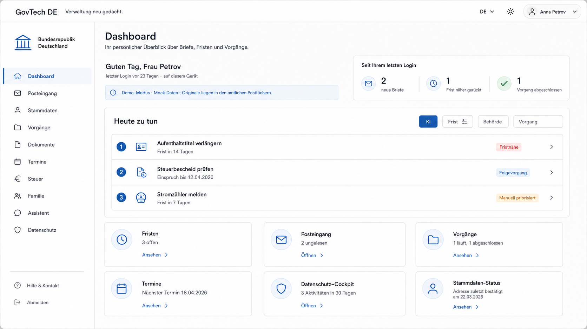
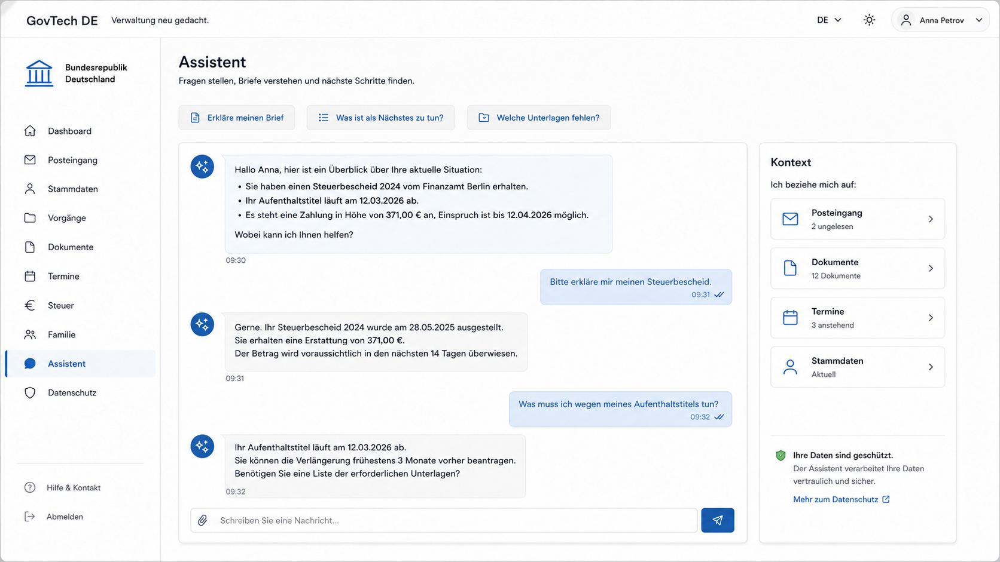
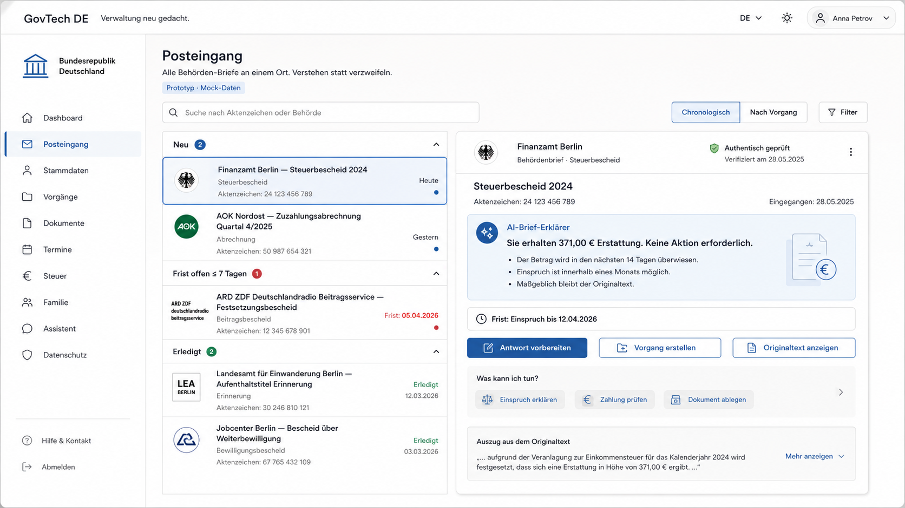
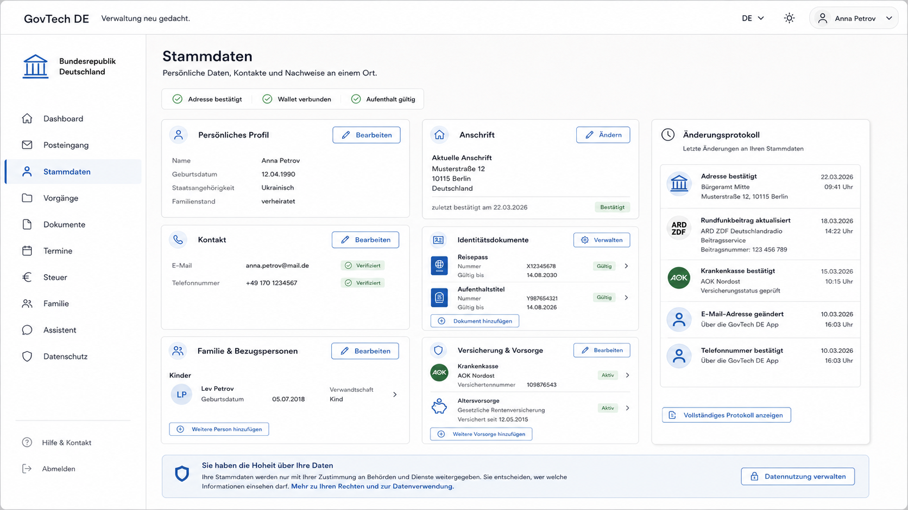
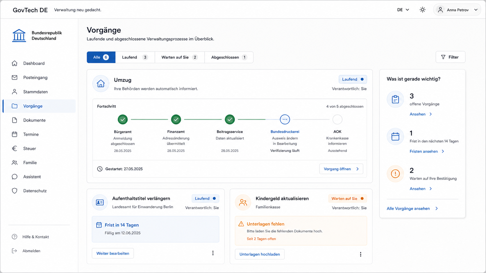
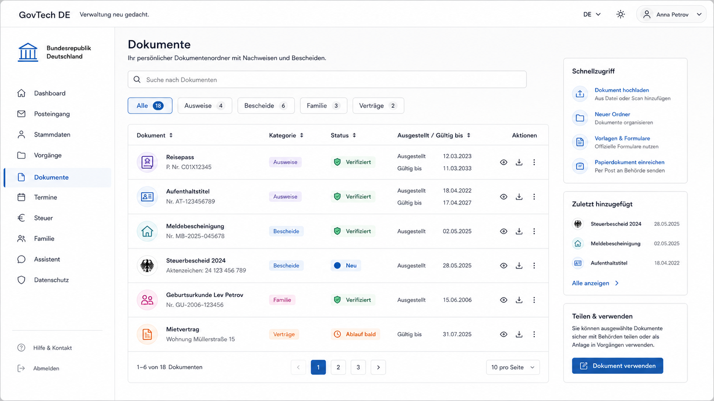
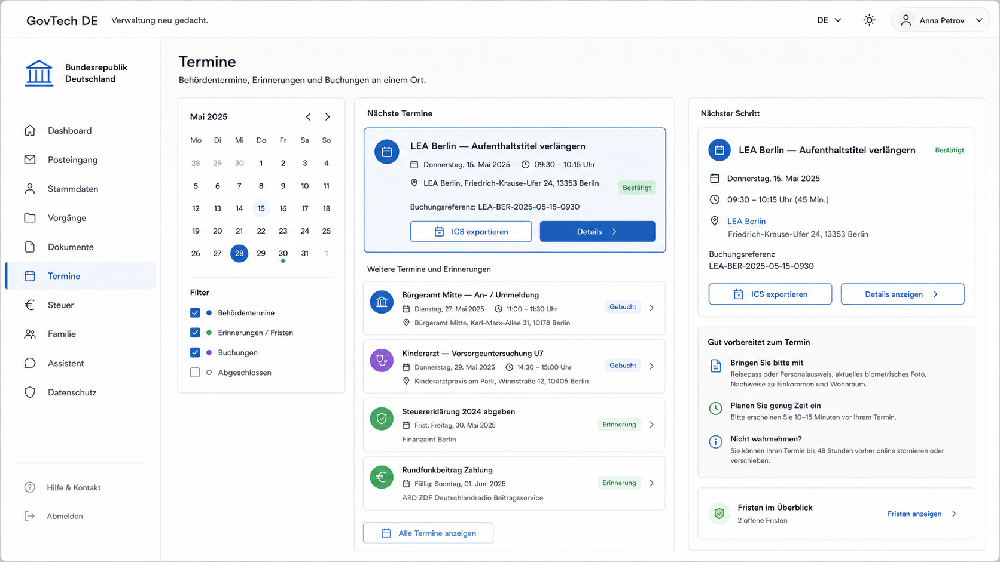
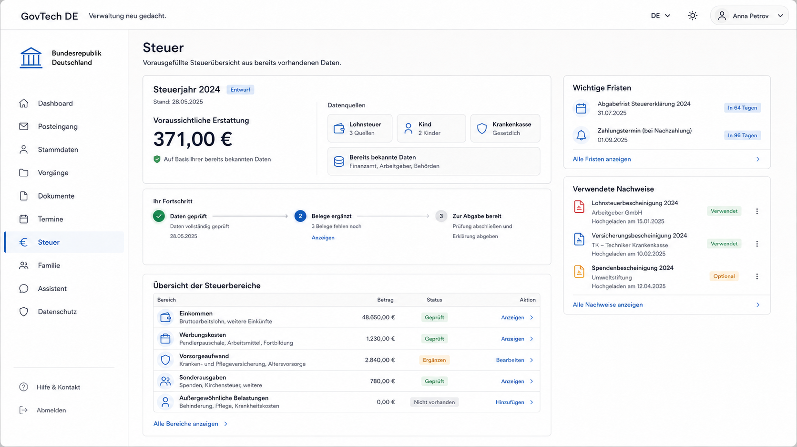
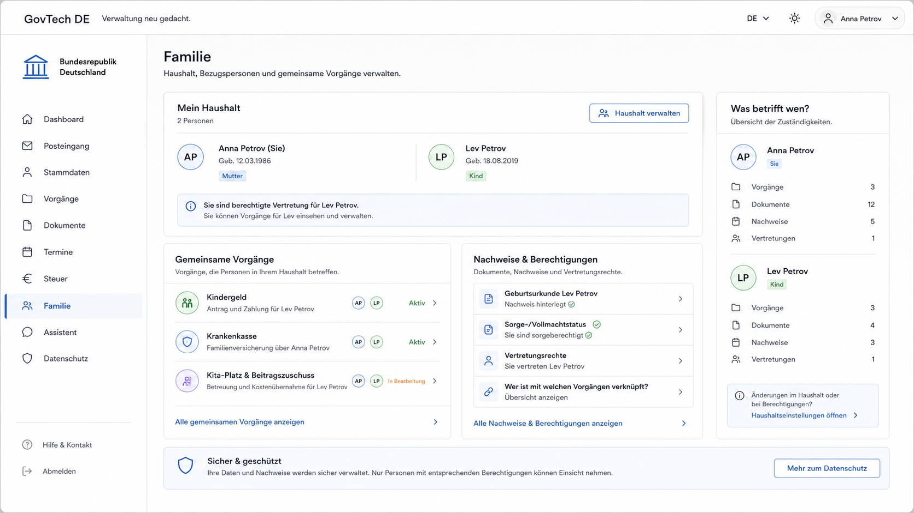
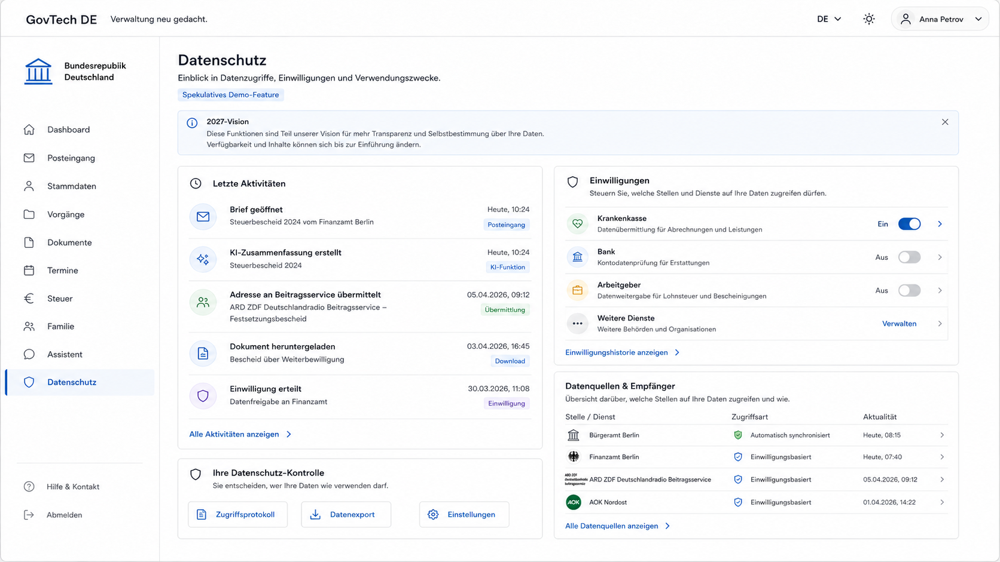

# GovTech DE — Verwaltung neu gedacht

> **Ein:e Bürger:in sagt einmal „ich ziehe um" — und das System informiert jede zuständige Behörde.**
>
> Speculative-Design-Prototyp einer bürgerzentrierten Interaktionsschicht für die deutsche Verwaltung, gedacht für ~2027 auf Basis von DeutschlandID + EUDI Wallet + Deutschland-Stack.
>
> **Alle Daten sind erfunden. Keine echte Behörde ist angebunden.**

**▶ [Live-Demo ausprobieren](https://govtech-de.vercel.app/)** · **🎬 [Video-Walkthrough ansehen (1 Min)](https://youtu.be/sFbvv2xuozg)**

> **Ehrliche Notiz zur Live-Demo:** Der frei formulierte KI-Turn des Assistenten **ruht im öffentlichen Deployment — bewusst.** Hinter jeder Antwort stünde ein echter Claude-API-Aufruf, und ein Prototyp, der Datenminimierung predigt, lebt auch Kostenminimierung vor. Alles andere läuft vollständig im Browser auf dem Mock-Backend: alle zehn Oberflächen, der Posteingang mit verständlichen Zusammenfassungen und die komplette **Umzug-Kaskade** über *Vorgänge → „Umzug melden“*. Den natürlichsprachigen Weg („leite meinen Umzug ein“) zeigt das [Walkthrough-Video](https://youtu.be/sFbvv2xuozg) — oder Sie klonen das Repo und hinterlegen den eigenen `ANTHROPIC_API_KEY` ([Lokal starten](#lokal-starten), fünf Minuten).

---

## Das Problem

Ein Umzug in Deutschland ist kein Vorgang — er sind sechs. Die Bürger:in meldet sich beim **Einwohnermeldeamt** um, informiert das **Finanzamt**, ändert die Halterdaten bei der **KFZ-Zulassungsstelle**, meldet die neue Adresse der **Krankenkasse**, korrigiert den **Rundfunkbeitrag** und sagt der/dem **Arbeitgeber:in** Bescheid. Sechs Stellen, sechs Formate, sechs Wartezeiten — für ein einziges Lebensereignis, das der Staat ohnehin schon kennt.

Das ist kein Formular-Problem, sondern ein Koordinations-Problem. Schnellere Formulare lösen es nicht. Die eigentliche Frage lautet: Warum muss die Bürger:in die Behörden koordinieren — und nicht umgekehrt?

## Der Wow-Moment

Die Bürger:in sagt dem Assistenten **einmal** in natürlicher Sprache: **„leite meinen Umzug ein"**.

Der Assistent fragt das Nötige nach — neue Adresse, Stichtag, für welche Empfänger eine Einwilligung erteilt wird —, zeigt eine **Bestätigungskarte**, und löst **erst nach ausdrücklichem „Umzug starten"** die Kaskade aus. Sie läuft **inline im Assistenten-Verlauf** — die Bürger:in sieht zu, wie die Bestätigungen eintreffen, gestaffelt nach Rechtsgrundlage:

```
Einwohnermeldeamt   ✓ Bestätigt               automatisch · § 17 BMG
Finanzamt           ✓ Bestätigt               automatisch · § 19 AO
Beitragsservice     ✓ Bestätigt               automatisch · § 11 RBStV
Bundesdruckerei     ✓ Bestätigt               automatisch · § 28 PAuswG
Familienkasse       ⊙ Ihre Bestätigung nötig  → [Mit eID bestätigen] → ✓
Ausländerbehörde    ⊙ Ihre Bestätigung nötig  → [Mit eID bestätigen] → ✓
Krankenkasse        ✓ Bestätigt               mit Einwilligung · Art. 6 DSGVO
Arbeitgeber         ✓ Bestätigt               mit Einwilligung · Art. 6 DSGVO
```

Aus **vielen separaten Behördengängen** wird **ein Satz** — und die Bürger:in behält die Kontrolle über die sensiblen Schritte. Die Empfänger werden ehrlich nach Rechtsgrundlage gestaffelt: **automatisch** nach Bundesmeldegesetz (§ 36 BMG), **erst auf eID-Bestätigung** bei besonders sensiblen Stellen (§ 18 PAuswG — nutzergesteuert, *kein* automatischer Melderegister-Abgleich), und **nur mit Einwilligung** bei privaten Empfängern (Art. 6 Abs. 1 lit. a/b DSGVO). Zum Abschluss erscheinen inline ein **Once-Only-Zähler** („Felder, die Sie nicht ausfüllen mussten"), die Quelle (Ihre Stammdaten) und ein **Wert-Beleg** — danach landen die Bestätigungsschreiben im Posteingang, jedes mit einer verständlichen KI-Zusammenfassung.

**Der Autopilot ist der Held.** Nicht das schnellere Formular, sondern das, was das System *für* die Bürger:in erledigt.

## Was es ist (und was nicht)

Dies ist ein **Speculative-Design-Prototyp** — ein portfolio-reifer Entwurf davon, wie sich eine bürgerzentrierte Verwaltungs-Oberfläche im Jahr ~2027 anfühlen *könnte*, aufgesetzt auf die bereits beschlossenen Bausteine DeutschlandID, EUDI Wallet und Deutschland-Stack.

**Ehrlicher Disclaimer:**

- **Alle Daten sind erfunden** — Personas, Briefe, Aktenzeichen und Behörden-Antworten sind Mock-Daten. Sie sehen realistisch aus (echte Behörden-Bezeichnungen, reale PLZ, korrekte Aktenzeichen-Formate), sind aber synthetisch.
- **Keine echte Behörde ist angebunden.** Es gibt keine Integration mit realen Fachverfahren. Das Mock-Backend simuliert REST-Antworten und persistiert lokal im Browser.
- Es ist eine **Vision, kein Produkt** — ein Gesprächsangebot über das, was möglich wäre, nicht eine Behauptung, dass es das bereits gibt.

> **Kein neues Zentralregister.** Ihre Daten bleiben dort, wo sie heute schon liegen — in den Registern der zuständigen Stellen. Diese Schicht *vermittelt* nur und ruft Nachweise bei Bedarf ab (Once-Only über NOOTS), statt sie in einem neuen Datentopf zu sammeln. Datenschutzrechtlich Verantwortliche bleiben die einzelnen Behörden.

## Verhältnis zum Status quo

Dieser Prototyp ist **informierte Spekulation auf bestehenden Schienen**, keine Behauptung, das Gezeigte existiere heute schon flächendeckend. Er setzt auf der für **2027 erwarteten Reife** der staatlichen Bausteine auf und entwirft die Bürger:innen-Interaktionsschicht darüber:

- **DeutschlandID** — die heutige **BundID** (vormals *Nutzerkonto Bund*) wird schrittweise zur DeutschlandID weiterentwickelt; perspektivisch ein bundesweites Bürgerkonto. Wir mocken den Login in diese Richtung.
- **Verwaltungsportal-Verbund + OZG** — Bund, Länder und Kommunen verknüpfen ihre Portale; das **OZG 2.0** (in Kraft seit Juli 2024) verzahnt Digitalisierung mit Registermodernisierung und digitalen Identitäten.
- **Registermodernisierung + NOOTS (Once-Only)** — das **National-Once-Only-Technical-System** liefert die Grundlage, Nachweise aus den Quellregistern abzurufen statt sie erneut zu verlangen (erste Stufe Anfang 2026 gestartet, voller Rollout bis Ende 2026 angestrebt).
- **Antragsloses Kindergeld** — **beschlossene Gesetzgebung** (Kabinettsbeschluss 18.03.2026), nicht Spekulation: ab 2027 zahlt die Familienkasse bei vorliegender IBAN automatisch, Trigger ist die Steuer-ID.
- **EUDI Wallet (eIDAS 2.0)** — VO (EU) 2024/1183; nationale Pilotphasen seit Mai 2026, deutscher Start einer ersten Stufe zum 2. Januar 2027 angestrebt. Wir bilden Wallet-Flows (selektive Offenlegung, Datenminimierung) als 2027-Zielbild ab, mit `[MOCK]`-Kennzeichnung.

**Was dieser Prototyp ist:** eine spekulative, bürgerzentrierte Interaktionsschicht auf DeutschlandID + EUDI Wallet + Deutschland-Stack, die deren Reife für 2027 annimmt. **Was er nicht ist:** eine reale Integration — es werden keine Daten an echte Behörden übermittelt oder aus echten Registern abgerufen; die Behörden-zu-Behörden-Kaskade ist simuliert und so gerahmt: *„wenn die Register angebunden wären …"*. Antragsgebundene Leistungen werden als *„Anspruch erkannt — Antrag vorbereitet"* dargestellt, nie als *„läuft bereits"* (das gilt allein für das antragslose Kindergeld).

## Die Oberflächen

Diese Screenshots zeigen das **tatsächlich umgesetzte Design** der zehn Oberflächen, funktionsfähig auf dem Mock-Backend.

### Dashboard — „heute zu tun"



*Persönlicher Überblick: offene Briefe, Fristen, der Umzug-Anstoß. Eine KI-gestützte Priorisierung sortiert, was heute wirklich wichtig ist.*

### Assistent — der Held



*Konversationelle KI mit Tool-Use — hier mitten in der Kaskade, inline im Verlauf: die statutarischen Stellen sind bereits „Bestätigt“ (jede Zeile mit ihrer Rechtsgrundlage), das Landesamt für Einwanderung wartet auf die ausdrückliche **„Mit eID bestätigen“**-Freigabe, private Empfänger laufen nur mit Einwilligung. Ein Satz — „leite meinen Umzug ein“ — hat das ausgelöst; die Kontrolle über die sensiblen Schritte bleibt bei der Bürger:in.*

### Posteingang



*Gebündelter Eingang aller Behörden-Briefe mit KI-Zusammenfassung in Klartext, Echtheits-Hinweis und der einen erforderlichen Handlung — statt Amtsdeutsch.*

### Stammdaten



*Single Source of Truth: persönliche Daten, Kontakt, Identitätsdokumente — einmal gepflegt, überall genutzt. Jede Sektion zeigt, wer wann zugegriffen hat.*

### Vorgänge



*Laufende und abgeschlossene Verwaltungsprozesse in Übersicht — inklusive der Umzug-Autopilot-Timeline, in der jede Behörde nacheinander „empfängt".*

### Dokumente



*QR-verifizierbarer Dokumenten-Tresor mit EUDI-Wallet-Export. Nachweise teilen, ohne das Original aus der Hand zu geben.*

### Termine



*Alle Behörden-Termine an einem Ort, mit Kalender-Integration und dem jeweils nächsten Schritt. Vor-Ort oder Video.*

### Steuer



*Vorausgefüllte Steuererklärung aus bereits bekannten Daten: voraussichtliche Erstattung, Bereichs-Übersicht, wichtige Fristen — Pre-Fill statt leerem Formular.*

### Familie



*Gemeinsamer Haushalt, geteilte Vorgänge, Berechtigungen pro Person — wer welche Daten sehen und welche Vorgänge mitverwalten darf.*

### Datenschutz



*Granulare Einwilligungs-Steuerung: wer welche Datenart auf welcher Rechtsgrundlage sieht, mit nachvollziehbarem Aktivitätsprotokoll und jederzeit widerruflicher Einwilligung.*

---

### Die zehn Oberflächen auf einen Blick

| Oberfläche | Was sie tut | Der Autopilot-/KI-Hebel |
|---|---|---|
| **Dashboard** | Persönlicher Überblick: offene Briefe, Fristen, „heute zu tun" | KI-Priorisierung sortiert die heutigen Aufgaben nach Dringlichkeit |
| **Assistent** | Konversationelle KI mit Tool-Use | **Der Held** — „ich ziehe um" → Bestätigung → echte Behörden-Kaskade |
| **Posteingang** | Gebündelter Eingang aller Behörden-Briefe | KI-Zusammenfassung in Klartext + die *eine* erforderliche Handlung |
| **Stammdaten** | Single Source of Truth für persönliche Daten | Einmal gepflegt, von jedem Vorgang automatisch genutzt |
| **Vorgänge** | Laufende & abgeschlossene Prozesse | Autopilot-Timeline: jede Behörde „empfängt" nacheinander |
| **Dokumente** | QR-verifizierbarer Tresor, EUDI-Export | Nachweise teilen ohne Herausgabe des Originals |
| **Termine** | Alle Behörden-Termine, Kalender-Integration | Nächster-Schritt-Empfehlung pro Termin |
| **Steuer** | Vorausgefüllte Steuererklärung | Pre-Fill aus bekannten Daten statt leerem Formular |
| **Familie** | Gemeinsamer Haushalt, geteilte Vorgänge | Berechtigungen pro Person, Vorgänge gemeinsam verwalten |
| **Datenschutz** | Granulare Einwilligungs-Steuerung | Wer sieht was, auf welcher Rechtsgrundlage — jederzeit widerruflich |

## Glaubwürdigkeit (kein Nachgedanke)

Diese Eigenschaften sind im Prototyp erstklassig behandelt, nicht aufgeklebt:

- **Barrierefreiheit** — WCAG 2.1 AA + BITV 2.0 sind verpflichtend, nicht optional. Jeder Screen ist mit axe-core auditiert (0 kritische Verstöße) und Lighthouse-a11y > 95. Touch-Targets ≥ 44px, sichtbarer Fokus, `prefers-reduced-motion` respektiert, echte Landmarks und Heading-Hierarchie.
- **Mehrsprachigkeit** — sechs Sprachen: Deutsch (Quelle, Sie-Form), Englisch, Russisch, Ukrainisch, **Arabisch (mit RTL-Audit)** und Türkisch. Strings nie hartkodiert, alle über `next-intl`.
- **Privacy by Design** — jeder Screen mit personenbezogenen Daten zeigt, *was* verarbeitet wird, *durch wen* und *auf welcher Rechtsgrundlage*. Datenminimierung ist sichtbar: der Block-B-Versand beim Umzug läuft nur mit Einwilligung (Art. 6 Abs. 1 lit. a DSGVO) und ist jederzeit widerruflich.
- **Realismus** — echte Behörden-Bezeichnungen, reale PLZ, korrekte Aktenzeichen- und Norm-Zitat-Formate. Wo hilfreich mit `[MOCK]` gekennzeichnet.

## Tech-Stack

| Schicht | Wahl |
|---|---|
| Framework | Next.js 15 (App Router) |
| Sprache | TypeScript (strict) |
| UI | Tailwind v4 + shadcn/ui + lucide-react |
| Animation | framer-motion (sparsam) |
| State | React Server Components + `useState`/`useReducer` |
| Mock-Backend | TypeScript-Modul, simuliert REST, persistiert in `localStorage` |
| KI-Assistent | `@anthropic-ai/sdk` + Claude Haiku 4.5, Prompt-Caching aktiv, Tool-Use für die Autopilot-Aktionen |
| i18n | `next-intl` (6 Sprachen, inkl. AR-RTL) |
| Testing | Playwright (e2e + a11y via `@axe-core/playwright`) |
| Deployment | Vercel |

## Für wen das ist — und die Bitte

Dieser Prototyp richtet sich an Menschen, die die deutsche Verwaltung bürgerzentriert weiterdenken: **DigitalService**, **BMDS**, **Tech4Germany**, **GovTech Deutschland**, **GovStart** — und alle, die an der Schnittstelle von Verwaltung, UX und KI arbeiten.

**Die Bitte:** Ich suche Rollen und Programme im deutschen GovTech-Ökosystem, in denen genau diese Art von bürgerzentriertem, glaubwürdigem Produkt-Denken gebraucht wird. Wenn dieser Entwurf eine Tür öffnet — lassen Sie uns sprechen.

## Lokal starten

```bash
pnpm install
cp .env.example .env.local   # ANTHROPIC_API_KEY ist OPTIONAL — siehe unten
pnpm dev
```

Öffnen Sie http://localhost:3000 und melden Sie sich als eine der drei Personas an (Anna, Familie Schmidt, Mehmet).

**Zwei Hinweise für eine reibungslose Vorführung:**

- **`ANTHROPIC_API_KEY` ist optional.** Ohne Key degradiert der Assistent würdevoll: statische Refusal-Texte und die Datenschutz-Hinweise funktionieren weiter; ein normaler KI-Turn zeigt sauber eine freundliche „Assistent derzeit nicht verfügbar"-Meldung statt abzustürzen. Für die volle Wow-Demo (natürlichsprachiger Umzug → Bestätigungskarte → Kaskade) wird ein gültiger Key benötigt.
- **`?reliable=1`** an die URL hängen schaltet die simulierten Backend-Fehler (5%-Fehlerquote, künstliche Latenz) ab — empfohlen für Screencasts und Video-Aufnahmen.

**Qualitäts-Gates lokal nachvollziehen** (dieselben Prüfungen, die das Projekt grün hält):

```bash
pnpm typecheck   # TypeScript (strict), keine Fehler
pnpm test:unit   # Vitest — Unit-Tests (Mock-Backend, KI-Hilfslogik, Rate-Limit)
pnpm test:e2e    # Playwright — End-to-End, inkl. Spine-Flow (Umzug-Kaskade)
pnpm test:a11y   # Playwright + axe-core — Barrierefreiheits-Audit (WCAG 2.1 AA)
```

### Kosten & Missbrauch

- **Kosten.** Ein normaler KI-Turn ruft `/api/assistant` auf, was die Anthropic-API mit **Ihrem** `ANTHROPIC_API_KEY` anspricht — bei einem eigenen Deployment entstehen also reale Token-Kosten auf Ihrer Rechnung. Modell ist Claude Haiku 4.5 mit aktivem Prompt-Caching, die Kosten pro Turn sind gering; ein offenes öffentliches Deployment ohne Limits kann sie dennoch summieren.
- **Schutz.** Die KI-Routen sind als Demo bewusst ohne Login, aber **rate-limitiert** (`src/lib/ai/rate-limit.ts`: ~20 Anfragen/Minute pro Session, plus Größen-Caps auf Nachrichten und Payload). Das deckt die API-Spend-/Verfügbarkeits-Angriffsfläche ab — es ist kein Ersatz für ein echtes Gateway/WAF im Produktivbetrieb.
- **Öffentliches Deployment.** Die gehostete Demo ([govtech-de.vercel.app](https://govtech-de.vercel.app/)) läuft **ohne hinterlegten Key** — der live-KI-Turn ruht dort bewusst (siehe Notiz oben am Anfang), alle übrigen Funktionen sind davon unberührt. So beträgt die öffentliche Angriffsfläche für API-Kosten exakt null — dieselbe Sparsamkeit, die der Prototyp bei Daten predigt, gilt hier fürs Budget.
- **Empfehlung für Self-Deployer.** Setzen Sie zusätzlich eigene Budget-Limits direkt in der Anthropic-Console und passen Sie die Werte in `rate-limit.ts` an Ihre Erwartungen an. Der Key ist **optional** — ohne ihn läuft die Demo weiter (siehe oben), nur der live-KI-Turn ruht.

---

## In English (condensed)

**GovTech DE — public administration, rethought.**

**▶ [Try the live demo](https://govtech-de.vercel.app/)** · **🎬 [Watch the walkthrough (1 min)](https://youtu.be/sFbvv2xuozg)**

A citizen says **„ich ziehe um"** (*I'm moving*) **once**, and the system notifies every competent authority for them — registration office, tax office, vehicle registration, health insurer, broadcasting fee, employer — while they watch the confirmations arrive. **The autopilot is the hero**, not a faster form.

This is a **speculative-design prototype** for ~2027, built on Germany's planned DeutschlandID + EUDI Wallet + Deutschland-Stack. **All data is mocked; no real authority is integrated.** It looks realistic (real authority names, real postal codes, correct file-reference formats) but is entirely synthetic — a vision, not a product.

**Ten surfaces, functional on a mock backend:** Dashboard (AI-prioritised „today's tasks"), **Assistent** (the conversational hero with tool use), Posteingang (unified authority inbox with plain-language AI summaries), Stammdaten (single source of truth), Vorgänge (process tracker + autopilot timeline), Dokumente (QR-verifiable vault + EUDI export), Termine (appointments), Steuer (pre-filled tax return), Familie (shared household), Datenschutz (granular consent control).

**Credibility as a first-class concern:** WCAG 2.1 AA + BITV 2.0 (axe 0 critical, Lighthouse a11y > 95), six languages incl. **Arabic with RTL audit**, privacy-by-design (every personal-data screen shows what is processed, by whom, on what legal basis), and realistic German authority data throughout.

**Stack:** Next.js 15 (App Router) · TypeScript strict · Tailwind v4 + shadcn/ui · framer-motion · next-intl · `@anthropic-ai/sdk` + Claude Haiku 4.5 (prompt caching + tool use) · Playwright + axe.

**Run it:** `pnpm install && pnpm dev`, open http://localhost:3000. `ANTHROPIC_API_KEY` is optional — the assistant degrades gracefully without it (a normal AI turn shows a friendly „assistant currently unavailable" message instead of crashing); append `?reliable=1` to disable simulated errors for screencasts. Reproduce the quality gates with `pnpm typecheck`, `pnpm test:unit`, `pnpm test:e2e`, and `pnpm test:a11y`.

**Cost & abuse:** the hosted demo ([govtech-de.vercel.app](https://govtech-de.vercel.app/)) runs **without a deployed key — deliberately**: every reply would be a real Claude API call, and a prototype that preaches data minimisation should practice cost minimisation too. The live AI turn rests there (public API-spend surface: exactly zero); everything else — all ten surfaces, the full Umzug cascade via *Vorgänge → „Umzug melden“* — runs fully in the browser on the mock backend. For self-hosting: a normal AI turn calls `/api/assistant`, which hits the Anthropic API on the deployer's own `ANTHROPIC_API_KEY` — so a self-hosted deployment incurs real token cost on your account (Claude Haiku 4.5 with prompt caching; cheap per turn, but an open public deployment can add up). The AI routes are intentionally login-less for the demo but **rate-limited** (`src/lib/ai/rate-limit.ts`: ~20 req/min per session, plus message/payload size caps) — enough for the API-spend/availability blast radius, not a substitute for a real gateway/WAF. **Self-deployers should set their own budget limits** in the Anthropic console and tune the values in `rate-limit.ts`. The key is optional; without it the demo still runs, only the live AI turn rests.

**Who it's for & the ask:** built for people rethinking German public administration around the citizen — DigitalService, BMDS, Tech4Germany, GovTech Deutschland, GovStart. I'm looking for roles and programs in the German GovTech ecosystem where this kind of citizen-first product thinking is needed. If this opens a door, let's talk.

---

## Lizenz

MIT.
